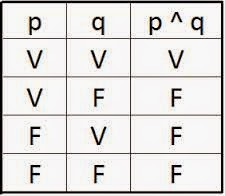

**Introducción a Python**

 

Estaremos viendo la sintaxis básica de Python, los principales tipos de datos y las colecciones de datos más utilizadas con ejemplos.

Las tres partes de esta sección son:

[Parte 1: Introducción a Python y Hola Mundo](#Parte 1: Introducción a Python)

*Parte 2 - Variables, Tipos de datos* 

*Parte 3: Funciones* 

*Parte 4:  Condicionales y Ciclos* 

*Parte 5: Estructuras de datos: Listas, Tuplas, diccionarios* 

*Parte 6: Numpy y Pandas*

*Parte 7:  Primeros pasos en el mundo de los datos y como orientar mi carrera profesional* 


***Parte 1: Introducción a Python***

Python: https://www.python.org/

Anaconda: https://www.anaconda.com/

Visual Studio: https://code.visualstudio.com/

Variables del Entorno:


Probando Python:


**Aprendiendo Online:** 

http://pythontutor.com/visualize.html#mode=edit

https://colab.research.google.com/

**Entornos virtuales**

https://virtualenv.pypa.io/en/latest/user_guide.html

```python
pip install virtualenv

virtualenv -p="C:\Users\Fighter\.conda\envs\py36\python.exe" newEnv
```

**Parte 2 -Tipos de datos en Python. Variables y asignaciones.**

Python es un lenguaje de programación interpretado. Hay dos formas de utilizar el intérprete: modos interactivo y script.

En modo interactivo, lo podemos usar en un entorno de un programa adjunto llamado **Jupyter Notebooks** que permite escribir una línea de código Python y el intérprete lo procesa inmediatamente y muestra el resultado.


Alternativamente, el código se puede almacenar en un archivo, que a veces se denomina script. El contenido del archivo se puede ejecutar con el intérprete. Por convención, los scripts de Python tienen nombres de archivo que terminan en .py. Uno de los beneficios de trabajar con un lenguaje interpretado es que puede probar bits de código en modo interactivo antes de que se coloque en un script.

En el código, se puede crear una variable y asignarle un valor. En Python, un nombre de variable puede ser arbitrariamente largo y puede contener tanto letras como números, pero debe comenzar con una letra. Se pueden usar letras mayúsculas y minúsculas, pero a menudo se recomienda comenzar con minúsculas. El signo de subrayado puede aparecer en un nombre y un nombre puede comenzar con un subrayado. Muy a menudo, el signo de subrayado se usa entre palabras en nombres largos. Este estilo a veces se conoce como snake case.

Es importante recordar que Python 3 tiene 35 palabras clave reservadas que no se pueden usar como nombres de variables. A continuación, se muestra la lista de palabras clave reservadas de Python 3.6 en su ortografía exacta (McKinney, 2017):


```python
False   class   finally  is     return

None    continue  for    lambda   try

True    def    from    nonlocal  while

and    del    global   not    with

as     elif    if     or     yield

assert   else    import   pass

break   except   in     raise
```


Los principales tipos de datos en Python son **integer, float, string y boolean**. 

Por ejemplo:

1 es un integer

1.2 es un float

"Hello, world!" es un string

"1.2" es Tambien un string.

 

Cualquier cadena de caracteres entre comillas simples o dobles es un valor de tipo cadena.

 Python es un lenguaje de tipado dinámico. El tipo de variable se establece cuando se le asigna un valor. No es necesario declarar el tipo de variable. La asignación de variable a un valor es fácil y concisa. Esto también nos permite cambiar el tipo de una variable más abajo en el código. El tipo de función incorporado devuelve el tipo de un objeto.

 A continuación, se muestran algunos ejemplos de asignaciones.

```python
my_string = "Hello, world!"
 
print(my_string)
print(type(my_string))

radius = 8
pi_number = 3.14

area_of_circle = pi_number * radius**2

print(area_of_circle)
print(type(area_of_circle))

a = True
print(a)
print(type(a))
```

 

También se puede hacer una cadena de asignaciones:

```
a = b = c = 10
```

 Otra forma es 

```
y0, y1 = "valor_1", "valor_2"
```

 En este caso, la variable y0 se asigna al valor_1 y la variable y1 se asigna al valor_1.

También se puede reasignar una variable:

```
x = 5
print(x)
x = 10
print(x)
```

 

**Expresiones y declaraciones**

Una declaración es una unidad de código que puede ejecutar el intérprete de Python. Por ejemplo, una asignación es una declaración. Una expresión es una combinación de valores, variables y operadores. Un valor en sí mismo se considera una expresión. Técnicamente, una expresión también es una declaración, pero probablemente sea más sencillo pensar en ellos como cosas diferentes. La diferencia importante es que una expresión tiene un valor; una declaración no lo hace.

Python admite los siguientes operadores en números: suma (+), resta (-), multiplicación (*), división (/). Python también admite división de enteros (//), resto o módulo (%) y exponenciación (**).

```python
'''Suma:'''
 
4 + 7 
 
'''Resta:'''
 
4-7 
'''Multiplicación:'''
 
4 * 7 

'''División:'''
4 / 7 

'''Division Entera:'''
 
4 // 7
 
'''Modulo – Es el residuo de la división de 2 números'''
 
4 % 7
 
'''Ejemplo de formateo: El tiempo de la pelicula es 135 minutos.
How long the movie runs, in hours and minutes?
''' 
  
minutes = 135
print ("La pelicula tiene {} hora(s) y {} minutos".format(minutes//60, minutes%60))
 
'''Exponenciación:'''
 
4 ** 7
 
 
```

Orden de los símbolos

- Paréntesis()
- Exponenciación  **
- Multiplicación/División 
- Sumas / Restas

 

```python
x = 3
x ** x ** x
(x ** x) ** x
x ** x * x
x ** x * x - x
```

 

Para saber si una variable es de un tipo se utiliza el comando **isinstance()**

```
x = 1
isinstance(x, int)
```

 

**Conversión de Tipos**

Para convertir tipos usamos los comandos `**str()**`**,** `**int()**`**,** `**float()**`

Se debe tener cuidado pues un string se puede convertir a números, obviamente solo si el contenido del a cadena representa un número.

 

```
int(15.9)
int('1')
str(8)
str(15.8)
bool(' ')
 
```

 

***Parte 3: Funciones*** 

Una función es una secuencia con nombre de declaraciones que realizan un cálculo. Las funciones nos permiten crear un bloque de declaraciones y hacer un programa más pequeño al eliminar el código repetitivo. Para definir una función, es necesario especificar el nombre y la secuencia de cálculo. El resultado se llama valor de retorno. Algunas funciones dan resultados. Otros realizan una acción (como imprimir), pero no devuelven un valor. Estos se conocen como funciones nulas.

Una vez definida, una función puede ser llamada por su nombre (llamada de función) cualquier número de veces a lo largo del programa. Las expresiones **type (a) y print (type (a))** son ejemplos de llamadas a funciones que hemos visto antes.

La definición de una nueva función debe comenzar con la palabra clave def seguida del nombre de la función y una lista de nombres de parámetros entre paréntesis. Esta primera fila de código, una definición de función termina con dos puntos (:). Si la función devuelve un valor, el cuerpo de la función termina con una declaración de retorno.

El cuerpo de la función contiene declaraciones que se ejecutarán cada vez que se llame a la función. El alcance de la función se especifica con las indentación del código. La indentación estándar es de 4 espacios.

La estructura general de la función se ve así:

```
def function_name(param_1, param_2,*arg,**kwargs):
     #do something with parameters
     #...
     argumentos= kwargs['firstarg'] + str(arg[0])
     final_result= argumentos
     return final_result
```


  ***Parte 4:  Condicionales y Ciclos*** 

**Condicionales**

La ejecución condicional permite la ejecución de código en función de determinadas condiciones. Las declaraciones condicionales más comunes son: if, else. La instrucción if ejecutará el código asociado si sus condiciones son verdaderas en el momento de la evaluación; de lo contrario, se ejecutará el código else.

```
score = 2.5
 
if (score > 3.0):
    print("Pasaste!")
else:
    print("Reprobaste.")
```

 

Un condiciónal depende declaraciones que retornan un verdadero o un falso. Para eso se hace uso de comparativos como los siguientes:


```
 x == y   tests for equality      
 x != y   x is not equal y (5 != 6 is True)   
 x > y    greater than            
 x < y    less than              
 x >= y   greater than or equal   
 x <= y   less than or equal  
 x is y   x is the same as y
```

NOTA: El operador **is** puede parecer el mismo que el operador de igualdad (==). De hecho, el operador comprueba si dos variables apuntan al mismo objeto, mientras que == comprueba si los valores de las dos variables son iguales.

A menudo, se requiere más de una comparación. Las expresiones de comparación se pueden combinar con operadores lógicos: **and**, o **or**. Estos tienen un significado similar en inglés.

Estas se comportan según las tablas de verdad.

               

Tabla de Verdad de Conjunción                Tabla de Verdad de Disyunción

 

En Python sería: 

 

```
#Operador `or` retorna True si alguno de los dos es True'''
 
x = True
y = False
x or y
```

 

Condicionales anidados

Un condicional puede contener a su vez otros condicionales como en este ejemplo que usa las palabras **elif y else**

```
a = 10
if (a > 10):
    print ("a is greater than 10")
elif (a < 10):
    print ("a is less than 10")
else:
    print ("a is equal to 10")
```

 

**Ciclos**

Un ciclo es un conjunto de expresiones que representan la ejecución reiterativa de un mismo código.

```
def counter():
    n=0
    while (n < 5):
        print("n is equal to " + str(n)) 
        n += 1
 
counter()
 
```

 

En este caso el siclo seguirá iterando desde el número cero y escribirá los numero hasta el valor de 4 subiendo de uno en uno.

NOTA: El operador + = se usó en el último ejemplo. Este operador proporciona una forma breve de actualizar una variable. La declaración de asignación aumentada **n + = 1** es equivalente a **n = n + 1** y es la combinación, en una sola declaración, de una operación binaria y una asignación. Otros ejemplos de declaraciones de asignación aumentadas son - =, * =, / =, // =, % =, ** =. 

 

Es muy importante tener en cuenta las condiciones de cerrado del ciclo sino se convertirán en ciclos infinitos. Como en este caso: 

```
#No llamar esta función
def counter():
    n=0
    while (n < 1):
        print("n is equal to " + str(n))
```

 

Al no tener una expresión que incremente a n, esté ciclo nunca se detendría. 

Para controlar mejor los ciclos se cuenta con las palabras **break** y **continue**.

```
def counter(n):
    while (n < 1000):
        if ((n * 11) % 7 == 0):
            print (n)
            break
        else:
            n += 1
 
counter(15)
```

 

La sentencia **break** nos permite salir de un bucle, la sentencia **continue** se puede usar para detener la iteración actual y continuar con la siguiente. En cuanto a la ilustración de la diferencia entre las declaraciones **break y continue**, imaginemos a un estudiante leyendo un libro sobre el lenguaje de programación Python capítulo por capítulo. Cada capítulo es una iteración; si, mientras lee el capítulo N, el estudiante se da cuenta de que está familiarizado con el contenido del capítulo N, pasaría al capítulo siguiente. Esta es una ejecución de la declaración continue. Si sucede algo que lo obliga a dejar de leer el libro (es decir, ella descubrió que el libro cubre Python 2, no Python 3); en este caso se ejecuta la sentencia break.

Consideremos el método de Newton para calcular raíces cuadradas como un ejemplo de un algoritmo en el que el número de iteraciones no se conoce de antemano. Para encontrar la raíz cuadrada del número n, se puede comenzar con casi cualquier estimación x y luego mejorar repetidamente la estimación con la siguiente fórmula **(x + n / x) / 2.** Se desconoce el número de pasos necesarios para obtener la respuesta correcta y se puede utilizar una declaración de interrupción cuando la estimación deja de cambiar.

```python
#Teniendo en cuenta que el número X es positivo…
 
def squareroot(x):
    est = x/2
    while True:
        print(est)
        y = (est + x/est)/2
        if y == est:
            break
        est = y
        
squareroot(256)
```

Otro tipo de ciclos son los definidos que conocemos como **FOR**

```python
for i in range(10):
	print(i)
for i in range(2,10):
	print(i)
for i in range(3,10,2):
	print(i)
```

**Recursividad.**

En Python también existe la recursividad que es una característica que permite a una función llamarse a si misma como recurso para continuar operando hasta que se cumpla una determinada condición.

```
def factorial(n):
    if n == 0:
        return 1
    else:
        result = n * factorial(n-1)
        return result
```

 

Si el argumento es 0, la función devuelve 1 ya que el factorial de 0 es 1 (0! = 1). Si se pasa cualquier otro número entero, ese número se multiplicará por n * factorial (n - 1) o que es lo mismo que n * (n-1)!

Entonces, factorial (n-1) se llamará a sí mismo y el cálculo será n * (n-1) * factorial (n-2) y así sucesivamente. La función seguirá llamándose a sí misma hasta que se alcance 0.

Al final obtendremos n \ * n-1 \ * n-2 \ * ... \ * 2 \ * 1.

***Parte 5: Estructuras de datos: Listas, Tuplas, diccionarios*** 

**Strings**

Una cadena es una secuencia de caracteres. Este tipo se llama ***str\***. En Python, una cadena se encierra entre comillas simples (') o dobles ("). Además, en Python, las comillas triples (' '') se pueden usar para encerrar cadenas que abarcan varias líneas. Las cadenas pueden contener letras, números o Caracteres especiales. También pueden estar vacíos, por ejemplo, "", o contener un carácter de espacio "". Una cadena es una secuencia ordenada de caracteres. Se puede acceder a los caracteres individuales de una cadena utilizando el índice del carácter, teniendo el primer carácter un valor de índice de 0. Se puede acceder a los caracteres de cadena con un índice negativo. Los índices negativos cuentan desde el lado derecho con el último carácter en el índice -1, el penúltimo en el índice -2 y así sucesivamente.

```python
s1 = "Python es el mejor lenguaje para analítica de datos"

print(s1[0])

print(s1[1])

s1[-1]
```

 

Si se desea saber la longitud o tamaño de un String y en general de algunos estructuras en Python se puede usar la función len()

```
len(s1)
```

 

**Slicing.**

Slice es un segmento de una cadena desde el índice inicial hasta el índice final, pero sin incluirlo.

```
s1[2:6]
s1[:2]
s1[2:]
s1[2:len(s1)]
```

 

En Python, las cadenas son ***inmutables\***: una vez creadas, las cadenas no se pueden cambiar. En su lugar, se debe crear una nueva cadena, que puede contener una o varias secciones de la cadena existente. Por ejemplo, la cadena 'get' no se puede cambiar a 'got'. El "Aprendí Python" no se puede cambiar a "Aprendo Python" mediante un cambio directo.

```
s2 = "get"
s2[1] = "o" #Esto da error
s2.replace('e', 'o')#Esto no cambia s2, se retorna un objeto diferente
s3 = s2[0] + "o" + s2[2]
print(s3)
print(s2)
learn_str = "Aprendí Python"
learn_str[:6] + "o" + " " + learn_str[7:]
 
 
```

**Operadores sobre cadenas de texto.**

En el último ejemplo, se utilizó el operador '+'. Este operador, cuando se usa entre dos cadenas, las concatena: "abc123" + "def456 'devuelve" abc123def456 ". Además, una cadena se puede multiplicar por un entero, ***str \* int\*** concatenará un número entero de copias de ***str\***. Pero una cadena no se puede multiplicar por otra cadena. Todos los demás operadores matemáticos también darán como resultado un TypeError.

Las cadenas se pueden comparar utilizando los operadores de igualdad (***==\***) y desigualdad (***! =\***). Los operadores ***'>'\*** y ***'<'\*** comparan dos cadenas por orden alfabético o de diccionario, no por longitud. 'a' <'b' devuelve Verdadero y 'aaaaa' <'bbb' también es Verdadero. Las letras mayúsculas son "menos" que las minúsculas.

El operador ***in\*** devuelve True si una subcadena aparece en cualquier lugar dentro de una cadena.

```
print('a'<'A')
print('b' > 'aaaaa')
print('on' in 'Python')
 
print(dir(str)) #Esto devuelve todos las funciones que se pueden aplicar a un string
 
help(str.find)#Esto ayuda a conocer la función find
 
 
```

 

**Recorrer un string**

```python
for item in s1:
    if item in 'aeiouAEIOU':
        print(item)
```

 

**Listas**

El último método mencionado en las subsecciones anteriores introdujo la lista. La lista es una secuencia de valores similar a una cadena. Si una cadena es una secuencia de caracteres, la lista es una colección de valores de cualquier tipo. Los valores de una lista se denominan elementos o elementos. Las listas son versátiles y, a veces, se las llama los "caballos de batalla" de Python.

Las listas pueden incluso contener otras listas como un elemento anidando listas. La forma más sencilla de crear una lista es encerrar la secuencia de valores entre corchetes []. Al igual que las cadenas, las listas pueden estar vacías. Trabajar con listas es similar a trabajar con cadenas. Por ejemplo, el método len () devolverá la longitud de la lista. La indexación y el corte de una lista también es muy similar a las cadenas.

```
'''Ejemplos de Listas'''
 
empty_list = []
list_of_numbers = [1, 2.3, 4.5, 6]
list_of_strings = [""]
 
```

s1= "Python es el mejor lenguaje para analítica de datos"

```
s1.split(" ") #Esto divide un string en una lista de palabras.
 
```

 

Las listas si son modificables a diferencia de los string.

```
list_of_numbers[2] = 100
list_of_numbers
```

 

Estos son algunos de los métodos o funciones para modificar una lista.

```python
list.append (item)  #Agrega un elemento al final de la lista.

list.extend (list_1) #Agrega los elementos de list_1 a la lista.

list.pop ([índice]) #Elimina el elemento con ese índice de la lista o al final de la lista si no se proporciona un índice.

list.remove (item) #Elimina la primera aparición del elemento.

list.reverse () #Invierte la lista.

list.insert (int, item) #Inserta un elemento en el índice dado, los siguientes elementos se desplazan hacia la derecha.
```

 

```python
list1 = [1,2,3,4]
list1.append(5)
list1.sort(reverse=True)
list1
 
list1.remove(3)
list1
 
list2 = [11, 12]
list1.extend(list2)
list1
 
```

 

Para recorrer una lista se usa el método for:

```python
#for elem in list_A:     
#    ...
#Una muy buena forma de generar datos entre un número y otro es con la función 
#range([start,] stop[, step])

range(5) #returns the sequence 0, 1, 2, 3, and 4;
range(1,4) #returns 1, 2, 3;
range(1, 10, 3) # returns 1, 4, 7.
```

Así para aplicarlo a una lista se puede usar la sintaxis: 

```

for i in range(len(list)):     
  ...
```

**Comprensión** **de Listas**

La comprensión de listas en Python proporciona una forma fácil y elegante de crear una nueva lista. Una aplicación común de la comprensión de listas es crear una nueva lista basada en una secuencia existente, p. Ej. una o más listas. Al crear una nueva lista con comprensión de lista, es posible que deseemos incluir solo ciertos elementos que satisfagan una determinada condición, o transformar elementos de una lista original mediante una operación o un cálculo aplicado a estos elementos.
Por ejemplo, podríamos tener una lista de números, nums. Necesitamos crear una nueva lista, llamémosla cuadrados, donde cada elemento es un cuadrado del elemento correspondiente de los números de la lista. Podemos escribir un bucle for que se verá de la siguiente manera:

```
nums = [0, 1, 2, 3, 4, 5, 6, 7]
squares = []
for x in nums:
    squares.append(x ** 2)
print(squares) 
```

 

Pero esto se puede simplificar mucho con la expresión:

```
squares = [x ** 2 for x in nums]
print(squares)
```

 Otro ejemplo: 

```
listA = [15, 35, 76, 83, 910, 1234]
listB = [1234, 234, 83, 3, 4, 5]
 
new_list = []
 
for a in listA:
    for b in listB:
        if a == b: 
            new_list.append(a)
 
print(new_list) 
```

  Esto se puede escribir como:

```
[a for a in listA for b in listB if a == b]
```

 Si quisiéramos saber todos los números impares multiplicados por 2 

```
[n * 2 for n in listA if n % 2 == 1]
```

 Que devuelve esto?

```
[(x, x**2) for x in range(6)]
```

**Tuplas:** 

Las tuplas son objetos de tipo secuencia, específicamente es un tipo de dato lista inmutable. Esta no puede modificarse de ningún modo después de su creación. Para aclarar, las tuplas son muy similares a las lista y comparten varias de sus funciones y métodos integrados, aunque su principal diferencia es que son inmutables.

```python
tupla= ('Hola',1, [2,3])
print(tupla)
print(tupla.count('Hola'))
print(tupla.index([2,3]))
```

**Diccionarios:**

Un Diccionario es una estructura de datos y un tipo de dato en Python con características especiales que nos permite almacenar cualquier tipo de valor como enteros, cadenas, listas e incluso otras funciones. Estos diccionarios nos permiten además identificar cada elemento por una clave (Key).

Tener en cuenta que para definir un diccionario, se encierra el listado de valores entre llaves ({}). Las parejas de clave y valor se separan con comas, y la clave y el valor se separan con dos puntos.

```python
dict={}
cadena=input('Dame una cadena de texto')
for c in cadena:
        if c in dict:
            dict[c]+=1
        else:
            dict[c]=1
            
for clave,valor in dict.items():
    print(clave,'->', valor)
```

***Parte 6: Numpy y Pandas***

**NumPy.**

Esta biblioteca le permite crear matrices y arreglos grandes a partir de datos importados. Por ejemplo, si importa datos en forma de lista, utilizando NumPy puede convertirlos en una matriz o arreglo. Esto le permitirá organizar y comprender fácilmente qué puntos de datos componen su muestra. Además, una vez que sus datos están organizados en una matriz o arreglo, puede aplicar las funciones matemáticas disponibles dentro de NumPy para sacar algunas conclusiones preliminares sobre su conjunto de datos.

Algunas de las características de NumPy:

Las matrices NumPy son objetos de matriz n-dimensionales, un componente central del cálculo científico y numérico en Python

NumPy proporciona herramientas para integrarse con el código C, C ++ y Fortran existente

NumPy también proporciona herramientas para realizar álgebra lineal, generar números aleatorios y herramientas para leer / escribir datos de matriz en el disco y trabajar con archivos mapeados en memoria.

Puede encontrar más información sobre NumPy en numpy.org (desarrolladores de NumPy, 2018).

NumPy almacena datos internamente en un bloque de memoria contiguo, independientemente de otros objetos Python integrados. La biblioteca de algoritmos de NumPy escritos en lenguaje C puede operar en esta memoria sin ninguna verificación de tipo u otra sobrecarga. Los arreglos NumPy también usan mucha menos memoria que las secuencias integradas de Python.

Las operaciones NumPy realizan cálculos complejos en arreglos completos sin la necesidad de bucles for de Python.

**Cree matrices NumPy a partir de listas, una descripción general de las propiedades de las matrices**

La biblioteca principal de NumPy es numerosa y necesitamos importar para poder usar la funcionalidad de NumPy.

```python
import numpy as np
```

 Los datos numéricos dispuestos en una estructura similar a una matriz en Python se pueden convertir en matrices usando la función array (). Los ejemplos más obvios de estructuras similares a matrices son listas y tuplas.

```
list_int = [8, 3, 34, 111]
a_int = np.array(list_int)
a_int
```

 

El rango de la matriz a_int es 1, es una matriz unidimensional de números. Para verificar el rango de la matriz, use ndim, que genera el número de ejes (dimensiones) de la matriz. Para ver cuáles son esas dimensiones, use .shape. La salida es una tupla de números enteros que indica el tamaño de la matriz en cada dimensión.

```
#dim
a_int.ndim
```

 

```
#shape
a_int.shape
```

 

```
#type
type(a_int) 
```

 

También tenemos el método dtype devuelve un objeto que describe el tipo de elementos de la matriz.

```
a_int.dtype
```

 

También se pueden crear estructuras de 2 o más dimensiones, como por ejemplo de listas.

```
list_2dim = [[1.5,2,3], [4,5,6]]
a_2dim = np.array(list_2dim)
a_2dim
```

 

También se puede de una lista y una tupla.

```
a_mix = np.array([[1, 2.0], [0, 0],(5.78, 3.)])
a_mix
```

 

Para crear secuencias de números, NumPy proporciona una función análoga a range () que devuelve matrices. La función arange () devuelve matrices con valores que se incrementan regularmente.

```
np.arange(10)
```

 

```
np.arange(2, 10, dtype=float)
```

 

```
np.arange(0, 10, 0.3) 
```

 

Para generar una matriz con algunos datos aleatorios, podemos usar la función np.random.randn (). La secuencia de números creada con esta función se distribuirá normalmente alrededor de su media. Para obtener una lista completa de funciones para muestreo aleatorio, consulte la documentación de NumPy, paquete numpy.random. (Comunidad SciPy, 2018)

 

**Pandas**

Pandas es una herramienta de manipulación de datos de alto nivel desarrollada por Wes McKinney. Es construido con el paquete Numpy y su estructura de datos clave es llamada el DataFrame. El DataFrame te permite almacenar y manipular datos tabulados en filas de observaciones y columnas de variables. Pandas es un paquete de Python que proporciona estructuras de datos similares a los dataframes de R. Pandas depende de Numpy, la librería que añade un potente tipo matricial a Python. Los principales tipos de datos que pueden representarse con pandas son: Datos tabulares con columnas de tipo heterogéneo con etiquetas en columnas y filas. 

Pandas proporciona herramientas que permiten: 

 leer y escribir datos en diferentes formatos: CSV, Microsoft Excel, bases SQL y formato HDF5 

 seleccionar y filtrar de manera sencilla tablas de datos en función de posición, valor o etiquetas

  fusionar y unir datos 

 transformar datos aplicando funciones tanto en global como por ventanas

 manipulación de series temporales

  hacer gráficas En pandas existen tres tipos básicos de objetos todos ellos basados a su vez en Numpy: Series (listas, 1D),DataFrame (tablas, 2D) y Panels (tablas 3D)

**Data Frames**

Los Data frames son como tablas donde se tienen columnas y filas muy similar a Excel. 

Para trabajar con estos frames necesitamos la librería Pandas

```python
import pandas as pd
```

 Y para crear un data frame tenemos la siguiente expresión: 

```python
df = pd.DataFrame(data=[[8, 128, 27.5],
                        [10, 138.9, 34.5],
                        [16, 157.3, 91.1],
                        [6, 116.6, 21.4],
                        [14, 159.2, 54.4]],
                  columns=['Age', 'Height', 'Weight'])
df
```

 

Donde se tienen varias listas para las filas y el titulo de las columnas. 

Para revisar y limpiar una estructura como esta se debe saber la información mas importante del data frame:

```
df.info()
```

 

Para saber los indices:

```
df.index
```

 

Para saber las columnas

```
df.columns
```

 

También se puede crear un data frame desde un diccionario:

```
area = {'province':['ON', 'QC', 'BC', 'AB', 'MB'],
        'area_land': [917741, 1356128, 925186, 642317, 553556],
        'area_water': [158654, 185928, 19549, 19531, 94241]}
```

 

Se puede leer un data frame desde un archivo csv:

```
# Leer un csv
prov_support = pd.read_csv('provincias.csv', sep=',') 
prov_support
```

 

Y se puede configurar mas atributos:

 

```python
prov_support = pd.read_csv('provincias.csv', 
                           sep=',', 
                           skiprows=1,   # Se salta la primera línea
                           header=None,  # Se especifica que no hay encabezados
                           names=['province_name','province','2016','2017','2018'], # names of columns
                           index_col='province')   # use column 'province' as index
prov_support
```

 

También se puede guardar un dataframe en un csv.

```
csv_out = prov_support.to_csv('csv_out1.csv')
csv_out
```

 

Y también se pueden guardar con atributos:

```
prov_support.to_csv('csv_out2.csv',
                    sep='\t',       #Separador de columnas
                    index=True,     #Si se guardan los indices
                    header=True)    #Se se guardan los encabezados
```

 

Se pueden renombrar las columnas de un data frame para limpiar y transformar los datos:

```
fed_sup = pd.read_csv('provincias.csv', sep=',') 
fed_sup.columns = ['Province Name', 'Province Abbreviation', '2016', '2017', '2018']
```

O también con esta instrucción.

```
fed_sup = fed_sup.rename(columns={'Province Name':'province_name', 'Province Abbreviation':'province'})
```

\#Para revisar las primeras 5 filas.

```
prov_support.head()
```

 

También podemos analizar los últimos: 

```
prov_support.tail()
```

 Para seleccionar solo una columna:

```
prov_support.loc['ON']
```

 O varias: 

```
prov_support.loc[['ON', 'BC', 'QC']]
```

 

```
prov_support.loc[:'NS'] 
```

 

Para seleccionar no por nombre sino por posición: 

```
prov_support.iloc[5]                       
```

 

O varias: 

```
prov_support.iloc[[5,9,4]]
prov_support.iloc[:3]  
```

 

También Podemos filtrar las columnas: 

```
prov_support[prov_support['2018'] > 3000]
```

 

```
prov_support[prov_support['2017'].isin(['22720', '21101'])]
```

 

```
prov_support[(prov_support['2017'] > 6000) & (prov_support.index.isin(['AB', 'ON', 'BC']))]
```

 

```
prov_support[~(prov_support['2017'] == 6680)] 
```

 

```
prov_support[prov_support['2017'] != 6680] 
```

 

También se pueden crear nuevas columnas

```
prov_support['2016-2018 change'] = prov_support['2018'] - prov_support['2016']

prov_support['2016-2018 change']
```

O borrar columnas:

```
prov_support.drop('2016', axis = 1)
```

 

```
prov_support.drop(['ON', 'QC'])
```

 

También se puede ordenar un data frame según una columna:

```
prov_support.sort_values('province_name') 
```

 

**Agrupamiento**

Un data frame se puede agrupar por sus columnas:

```python
import pandas as pd
import numpy as np

iris = pd.read_csv('iris.data', sep=',',
header=None, # the data file does not contain a header 
names=['sepal length','sepal width','petal length','petal width','class'] # names of columns
)
iris.head()
```

 

Agrupando por clase

```
iris_grouped = iris.groupby('class')
```

Calculando el promedio para cada clase:

```
 iris_grouped.mean()
```

  

**Visualización**

Se pueden hacer graficas

 

```python
houses = pd.DataFrame({ 'price, thousands': [200,300,400,500,600,700,800,900,1000], 'num of houses':[2,10,15,25,30,25,15,10,2] })
houses.head()
 

from matplotlib import pyplot as plt

%matplotlib inline

plt.style.use('seaborn-whitegrid')

plt.rcParams["figure.figsize"] = (7,7)

houses.plot(x = 'price, thousands', y = 'num of houses', kind='bar', color = 'blue', width=0.9)

plt.show()
```

***Parte 7:  Primeros pasos en el mundo de los datos y como orientar mi carrera profesional*** 

 


**Referencias:** 

Data Science Foundation - Course University of Toronto and University of Waterloo

McKinney, W. (2017). *Python for Data Analysis: Data Wrangling with Pandas, NumPy, and IPython* (2nd edition). O'Reilly Media.

NumPy developers (2018). *NumPy*. Disponible en [http://www.numpy.org/#](http://www.numpy.org/)

SciPy community (2018). *Random Sampling*. Disponible en https://docs.scipy.org/doc/numpy/reference/routines.random.html

